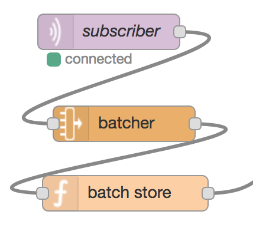

## 2. Store Batch of Data

The MQTT node (*subscriber*) receives the message for the topic it subscribed to, and hands it over to the batcher node.

The batcher node groups messages by topic and sends each group away as soon as the maximum per-topic capacity is reached, or a timeout occurs.

Finally, the function node stores the current message, including the batch just received, into memory for [later use](batch-read.md).