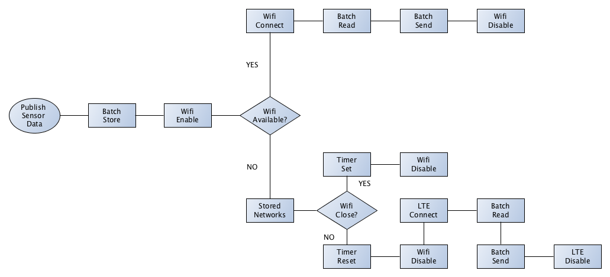

## Introduction
This guide aims to explain the logic and the components of eWine's IoT orchestrator, implemented as a Node-RED flow and designed to work on Raspberry Pi 3.

The general logic implemented by the flow is the following:

1. collect sensor data
2. batch sensor data
3. enable Wi-Fi
4. if a Wi-Fi network is available, then connect to it and send the batch
5. otherwise:
    * if the device is close enough to some Wi-Fi network, then wait (until some network is in range or a timeout occurs)
    * otherwise, send the batch using LTE connectivity

The rest of the guide explains each logical unit in the picture above in more detail:

0. [Set api-key and header](set-apikey-header.md)
1. [Publish Sensor Data](sensor-publish.md)
2. [Store Batch of Data](batch-store.md)
3. [Enable Wi-Fi](wifi-enable.md)
4. [Find an available Wi-Fi network](wifi-available.md)
5. [Connect to Wi-Fi network](wifi-connect.md)
6. [Retrieve Network Configurations](stored-networks.md)
7. [Is the device close to any Wi-Fi network?](wifi-close.md)
8. [Timer Set](timer-set.md)
9. [Timer Reset](timer-reset.md)
10. [Read Batch of Data](batch-read.md)
11. [Send Batch of Data over Wi-Fi](wifi-send.md)
12. [Send Batch of Data over LTE](lte-send.md)
13. [Disable Wi-Fi](wifi-disable.md)
