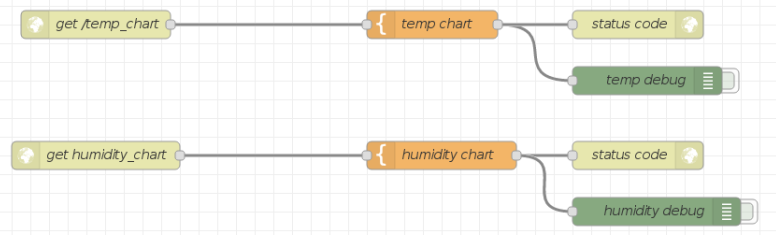

# 3. Showing data in a chart and conversion in an image

## Nodes

- get /temp_chart (/humidity_chart): set the uri in Node-red
- temp chart (humidity chart): html and javascript code. They read JSON data from the file created in the flow above, convert the data in a chart then save it as an image.
- status: response http
- temp debug (humidity debug): debug