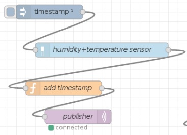

# 1. Retrieving and sending sensor data

##Nodes
- Timestamp: set the frequency of retrieving data (evry xx secs, minutes,hours,etc)
- Humidity+temperature sensor: communicate with the sensor
- Add timestamp: all data (sensor and timestamp) are put in a JSON array
- Publisher: mqqt sender data