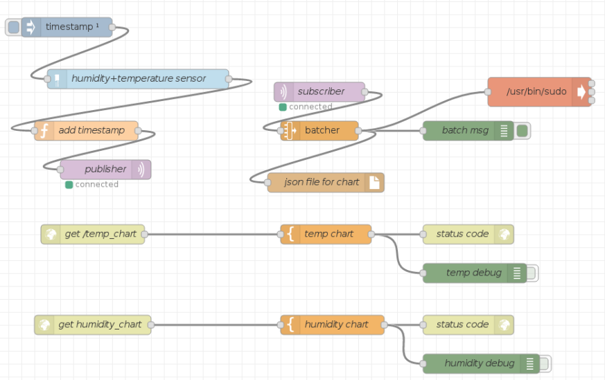

# Introduction
	This guide aims to explain the logic and the components of eWine's IoT orchestrator, implemented as a Node-RED flow and designed to work on Raspberry Pi 3.
	The general logic implemented by the flow is the following:

	1. Collect sensor data
	2. Batch sensor data
	3. Store data in a JSON file
	4. Convert data into an image file
	5. Store image file in a specific Scampi folder

## Summary :

1. [Retrieving and sending sensor data](retrieving_sending_sensor_data.md)
1. [Storing sensor data and images](storing_data_images.md)
1. [Showing data in a chart and conversion in an image](chart_conversion_data_image.md)
