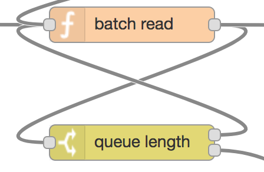

## 10. Read Batch of Data

The function node (*batch read*) reads one batch of data from memory and returns it to be sent, either via [Wi-Fi](wifi-send.md) or [LTE](lte-send.md).

The switch node (*queue length*) implements a loop, in order to read all batches from memory, until none is left.

After the last batch of data has been read and sent out, [Wi-Fi is disabled](wifi-disable.md).

