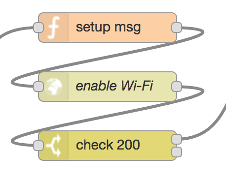

## 3. Enable Wi-Fi

The function node prepares the `msg` object to be sent as http request to the [Wi-Fi connectivity manager][1], including the API key header for authentication.

The http request node (*enable Wi-Fi*) sends a POST request to the connectivity manager in order to activate the Wi-Fi network interface on the device.

Finally, the switch node checks the status code in the response for confirmation.

[1]:https://github.com/martel-innovate/eWine-connectivity-manager