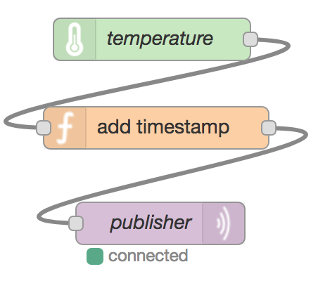

## 1. Publish Sensor Data

At regular time invervals, the sensor node (green in the picture) reads a value from a device sensor.

The function node wraps the value just received into a new JSON object, appending a timestamp to it.

The MQTT node (*publisher*) publishes the message on the local MQTT server with a given topic (e.g. temperature).

If e.g. the temperature is 20 degrees, the resulting `msg` object will look as follows:

    {
        "topic": "temperature",
        "payload": "{
            "timestamp": 1507670724119,
            "value": 20
        }"
    }