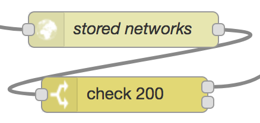

## 6. Retrieve Network Configurations

When the check on the `msg.availableWifi` flag yields a negative result, the flow must take an appropriate decision about connectivity, i.e. wait for a Wi-Fi network to become available, or use LTE connectivity to send away the batch of data. In this case, the flow proceeds to the section illustrated in the picture.

The http request node (*stored networks*) sends a GET request to the [Wi-Fi connectivity manager][1], in order to retrieve a list of network configurations that have previously been stored on the device. Each configuration includes GPS coordinates, such that, at a later stage, it will be possible to compute the distance between the device and the stored location of a network.

The response is checked for status code 200 before the flow can [proceed](close.md).

[1]:https://github.com/martel-innovate/eWine-connectivity-manager