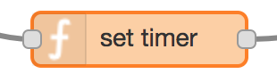

## 8. Timer Set

The function node (*set timer*) starts a countdown timer that, when expires, causes the [*distance* function node](wifi-close.md) to opt for LTE connectivity.

After the timer starts, [Wi-Fi is disabled](wifi-disable.md) and the flow delays its decision about connectivity.