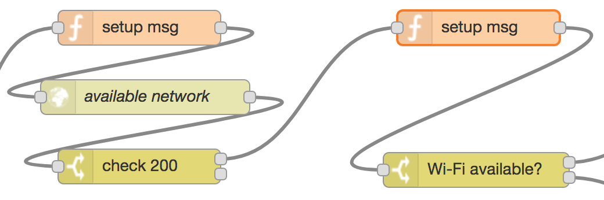

## 4. Find an available Wi-Fi network

The function node prepares the `msg` object to be sent as http request to the [Wi-Fi connectivity manager][1], including the API key header for authentication.

The http request node (*available network*) sends a GET request to the connectivity manager in order to retrieve the name of an available Wi-Fi network. If no Wi-Fi network is available, then an empty string is returned.

Thereafter, the switch node checks the status code in the response for confirmation.

After the status code is confirmed, the content of the response must be checked: first a new `msg` object is prepared for later http requests, including the API key header, GPS coordinates (latitude and longitude), and a `msg.availableWifi` flag to remember whether a Wi-Fi network is available; then, the `msg.availableWifi` flag is checked:

* if it's non-empty, the flow proceeds by [connecting to a Wi-Fi network](wifi-connect.md)
* [otherwise](stored-networks.md), either it waits or it connects to LTE

[1]:https://github.com/martel-innovate/eWine-connectivity-manager