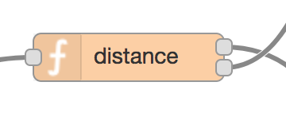

## 7. Is the device close to any Wi-Fi network?

To determine whether the device is close to any Wi-Fi network and can thus wait before connecting, the function node (*distance*) computes the distance between the device and the closest network configuration. Depending on whether the computed distance is above or below a given threshold, the flow can take two different directions:

* if the distance is below the threshold and no timer just expired, then a [timer is started](timer-set.md) and [Wi-Fi is disabled](wifi-disable.md)
* [otherwise](batch-read.md), the [timer is reset](timer-reset.md) and [data are sent](batch-read.md) using LTE connectivity