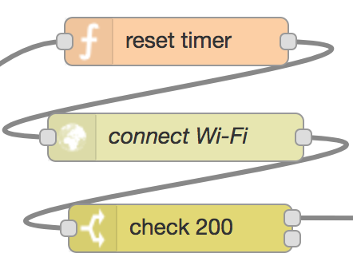

## 5. Connect to Wi-Fi network

Following up from the previous section, checking the `msg.availableWifi` flag determines whether the flow proceeds by connecting to a Wi-Fi network or not. In the positive case, the flag contains the name of the network to which the device can connect, and therefore the flow proceeds to the section illustrated in the picture.

The function node resets any active timer. The purpose of the timer is to control the amount of time the flow waits for Wi-Fi networks to become available.

The http request node (*connect Wi-Fi*) sends a POST request to the [Wi-Fi connectivity manager][1], including the name of the network to connect to and GPS coordinates.

Upon successful connection, a response with status code 200 is received, which is checked by the switch node before the flow can [proceed](batch-read.md).

[1]:https://github.com/martel-innovate/eWine-connectivity-manager